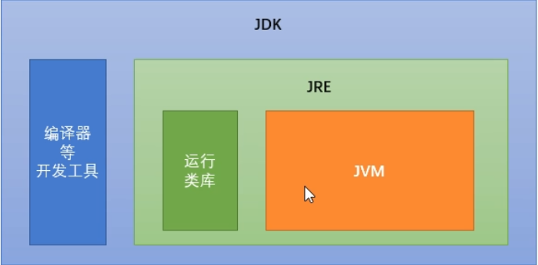

## 计算机存储单元

- 位（bit）：一个数字 0 或者一个数字 1 ，代表一位
- 字节（byte）：每逢 8 位是一个字节，这是数据存储的最小单位

1Byte = 8bit
1KB = 1024Byte
1MB = 1024KB
1GB = 1024MB
1TB = 1024GB
1PB = 1024TB

计算机中最小存储文件的单位是字节

## 命令提示符

MS-DOC(Microsoft Disk Operaing System)磁盘操作系统

命令提示符（cmd）

启动命令：win+r

### 命令提示符常用命令

1. cd . / .. 打开目录
2. dir 目录列表
3. exit 退出
4. cls 清空命令行

## java 语言的跨平台性

### java 虚拟机---JVM

- JVM（java virtual machine） java 虚拟机，简称虚拟机，是运行所有 java 程序的假象计算机，是 java 程序的运行环境，是 java 最具吸引力的特性之一，我们编写的 java 代码，都在 JVM 上运行。

- 跨平台： 任何软件的运行，都必须要运行在操作系统之上，而我们用 java 编写的软件可以运行在任何的操作系统之上，这个特性称之为 java 语言的跨平台特性。该特性由 JVM 实现的，java 运行在 JVM 上，JVM 运行在操作系统上。（java 具有跨平台性，但是 JVM 不具备跨平台性，不同的操作系统需要安装对应的不同版本的虚拟机）

### JRE 和 JDK

- JRE（Java Runtime Enviroment）：是 java 程序的运行时环境，包含 JVM 和运行时所需要的核心类库
- JDK（Java Development Kit）：是 java 程序开发工具包，包含 JRE 和开发人员使用的工具

想要运行一个已有的 java 程序，只需要安装一个 JRE
想要开发一个全新的 java 程序，需要安装 JDK

## Java JDK 下载安装和删除

Java SE 各版本的下载列表：https://www.oracle.com/java/technologies/downloads/archive/

删除 Java SE 只需要将 Java 目录删除，并且将配置的环境变量删除即可。
