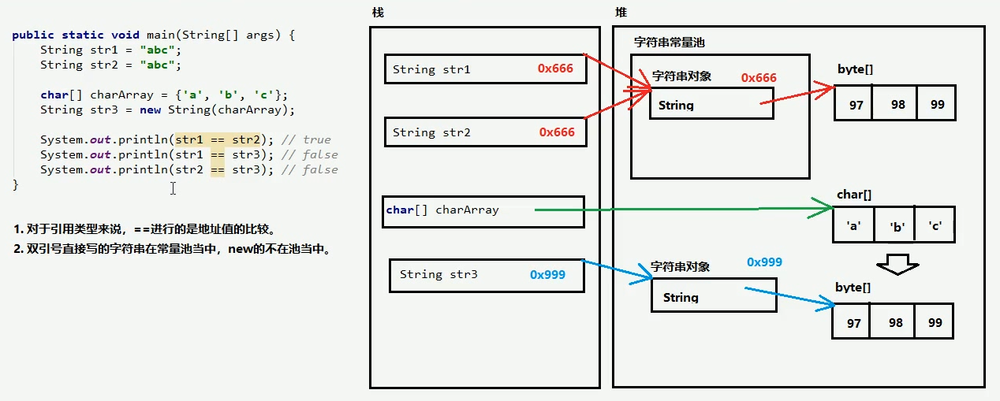

## 字符串注意事项

java.lang.String 类代表字符串
API 当中说：Java 程序中所有的字符串字面量（如"abc"）都作为此类的实例实现，其实就是说，程序当中所有的双引号字符串，都是 String 类的对象，即便没有 new

### 字符串的特点

1. 字符串的内容不可变
2. 因为字符串的内容不可变，所以字符串是可以共享使用的
3. 字符串效果上相当于 char[]字符串数组，但是底层原理是 byte[] 字节数组

### 字符串的 3+1 中创建方式

1. public String()
2. public String(char[] array)
3. public String(byte[] array)
4. 直接用字面量创建

### 字符串常量池

```java
public static void main(String[] args) {
    String str1 = "abc";
    String str2 = "abc";

    char[] charArray = new char[]{'a', 'b', 'c'};
    String str3 = new String(charArray);

    System.out.println(str1 == str2); // true
    System.out.println(str1 == str3); // false
    System.out.println(str3 == str2); // false
}
```



- 对于引用数据类型来说，==进行的是地址值的比较
- 双引号直接写的字符串在常量池中，new 的不在池中

### 字符串比较

- == 是进行对象的地址值比较,如果确实需要字符串的内容比较,可以使用两个方法
- `public boolean equals(Object obj)` 参数可以是任何对象,只有参数是一个字符串并且内容相同才会 return true,否则返回 false
- 注意事项:
  1. 任何对象都嫩改用 Object 进行接收
  2. equals 方法具有对称性,也就是 a.equals(b) 和 b.equals(a) 效果一样
  3. 如果比较双方一个常量一个变量,推荐把常量字符串卸载前面,如 "abc".equals(str);因为常量的 equals 是一定不会报错的,但是变量可能是 null ,这个时候就可能会出现空指针异常.
  4. equals 是区分大写的,如果需要忽略大小写需要使用 equalsIgnoreCase

### 字符串的获取方法

1. `public int length()` 获取字符串当中含有的字符个数，拿到字符串长度
2. `public String concat(String str)` 将当前字符串和参数字符串拼接成新的字符串并返回
3. `public char charAt(int index)` 获取指定索引位置的单个字符。（索引从 0 开始）
4. `public int indexOf(String str)` 查找参数字符串在本字符串当中首次出现的索引位置，如果没有返回 -1

### 字符串的截取方法

1. `public String substring(int index)` 截取从参数位置一直到字符串末尾，返回新的字符串,[index, 末尾] 2.` public String substring(int begin, int end)` 截取从 begin 到 end 中间的字符串，[begin, end)顾头不顾腚

```java
public static void main(String[] args) {
  String str1 = "Hello";
  System.out.println(str1); // Hello
  str1 = "Java";
  System.out.println(str1); // Java
}
```

### 注意事项：

1. 上述写法，字符串的内容仍然是没有改变的，其中涉及到两个字符串，"Hello" "Java"，str1 中保存的是地址值，本来的地址是 Hello 的 0x666 后来变成了 Java 的 0x999

### 字符串的转换相关的方法

1. `public char[] toCharArray()` 将当前字符串拆分成字符数组并返回
2. `public byte[] toBytes()` 获得当前字符串底层的字节数组
3. `public String replace(CharSequence oldString, CharSequence newString)` 将所有出现的老字符串替换成新的字符串，返回替换之后的结果字符串。

### 字符串的分割方法

1. `public String[] split(String regex)` 将此字符串按照欸顶你个的 regex（规则）拆分为字符串数组

### 注意事项：

1. split 方法参数其实是一个正则表达式，所以如果使用英文句点分割需要转义 "\\."
