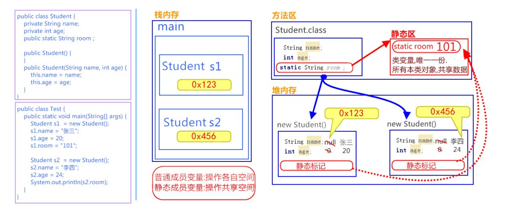

## static 关键字概述

static 可以用来修饰成员变量和成员方法，被修饰的成员是属于类的，而不是单单是属于某个对象的。也就是说，既然属于类，就可以耉创建对象来调用。

## 类变量

当 static 修饰成员变量时，该变量称为类变量，该类的每个对象都共享同一个类变量的值。任何对象都可以更改该类变量的值名单也可以在不创建该类的对象的情况下对类变量进行操作。

## 静态方法

当 static 修饰成员方法时，该方法称为类方法。静态方法在声明中有 static ，建议使用该类名来调用，而不需要创建类的对象。

### 静态方法调用的注意事项：

1. 静态方法可以直接访问类变量和静态方法。
2. 静态方法不能直接访问普通成员变量或成员方法。反之，成员方法可以直接访问类变量或静态方法。
3. 静态方法中，不能使用 this 关键字

_静态方法只能访问静态成员_

### 调用格式

被 static 修饰的成员可以并且建议通过类名直接访问。虽然也可以通过对象名访问静态成员，原因即多个对象均属于一个类，共享使用同一个静态成员，但是不建议，会出现警告信息。

## 静态原理图解

static 修饰的内容

- 是随着类的加载而加载的，且只加载一次。
- 存储于一块固定的内存区域（静态区），所以可以直接被类名调用。
- 它优先于对象存在，所以，可以被所有对象共享

## 静态代码快

定义在成员位置，使用 static 修饰的代码块{}

- 类中，方法外
- 随着类的加载而执行且只执行一次，优先于 main 方法和构造方法的执行
- 静态代码块的典型用途：用来一次性地对静态成员变量进行赋值

_static 关键字，可以修饰变量、方法、代码块。在使用过程中，主要目的还是想在不创建对象的情况下，去调用方法。_
