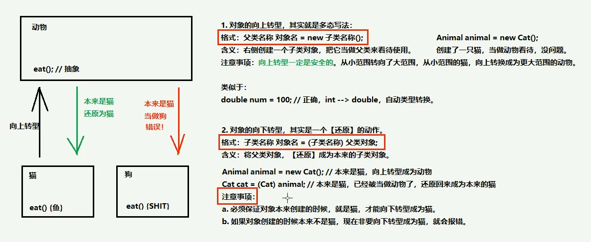

## 多态

代码中提现多态其实就是一句话，父类引用指向子类对象

格式：

父类名称 对象名 = new 子类名称();

或者

接口名称 对象名 = new 实现类名称();

```java
public class Demo01Multi {
  public static void main(String[] args) {
    // 多态：左侧父类的引用，指向了右侧子类的对象
    Fu obj = new Zi();

    obj.method(); // 子类父类都有的成员方法
    obj.methodFu(); // 父类独有的成员方法
  }
}
```

## 多态中成员变量的使用特点

访问成员变量的两种方式：

1.  直接通过对象名称访问成员变量，看等号左侧是谁，优先用谁，没有则向上找
2.  间接通过成员方法访问成员变量，看该方法属于谁，优先用谁，没有则向上找
    **成员变量不能重写**

## 多态中成员方法的使用特点

多态中，成员方法的方法问规则是：看 new 的是谁，就优先用谁，没有则向上找

## 向上转型 & 向下转型


